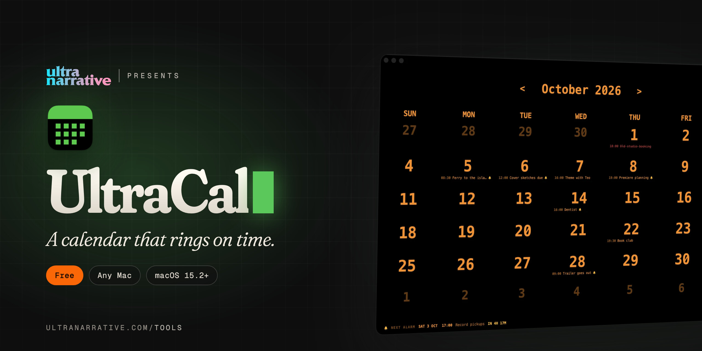

  

# UltraCal

**A calendar that rings on time.**

*Dan Rodriguez · [UltraNarrative](https://www.ultranarrative.com) · [ultranarrative.com/tools](https://www.ultranarrative.com/tools) · [dan@ultranarrative.com](mailto:dan@ultranarrative.com) · October 2026*

---

Appointments, repeating events and contacts, with alarms that ring on the exact second. Today's date sits on the Dock icon, even when the app is closed.

Free, for any Mac, Apple silicon or Intel, macOS 15.2 or later. This repository holds the installer only. More free apps at [ultranarrative.com/tools](https://www.ultranarrative.com/tools).

## Download

[UltraCal-mac-universal.dmg](https://github.com/ultranarrative/ultracal-releases/releases/latest/download/UltraCal-mac-universal.dmg)

This link always points to the newest version.

## Opening it the first time

I sign UltraCal myself rather than through Apple, so macOS asks once. Open the disk image, drag UltraCal to Applications and open it. When macOS stops it, go to System Settings, then Privacy & Security, and click Open Anyway.

## Support

UltraCal is free, with no account and no subscription. If it helps you, [buy me a coffee](https://ko-fi.com/danrsuarez).

Made by Dan Rodriguez at [UltraNarrative](https://ultranarrative.com). © 2026 UltraNarrative. All rights reserved.
